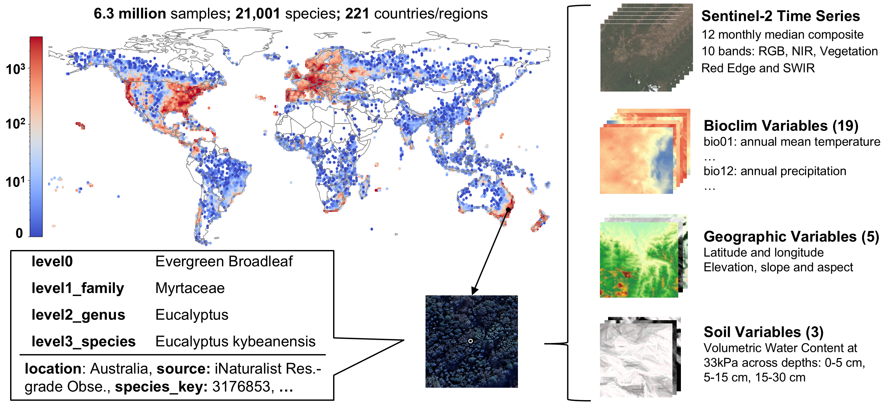

# GlobalGeoTree: A Multi-Granular Vision-Language Dataset for Global Tree Species Classification



GlobalGeoTree is a comprehensive global dataset for tree species classification, comprising 6.3 million geolocated tree occurrences spanning 275 families, 2,734 genera, and 21,001 species across hierarchical taxonomic levels. Each sample is paired with Sentinel-2 image time series and 27 auxiliary environmental variables.

## Dataset Overview

- **Total Samples**: 6.3 million geolocated tree occurrences
- **Geographic Coverage**: 221 countries/regions
- **Taxonomic Coverage**: 
  - 275 families
  - 2,734 genera
  - 21,001 species
- **Data Features**:
  - Sentinel-2 time series (12 monthly composites)
  - 27 auxiliary environmental variables
  - Hierarchical taxonomic labels

## Repository Structure

```
.
├── GlobalGeoTree/           # Dataset creation and processing
│   ├── gbif_occurrence_query.py    # GBIF data collection
│   ├── pair_data_downloader.py     # Remote sensing data download
│   ├── create_eval_set.py          # Evaluation set creation
│   └── convert_webdataset.py       # WebDataset conversion
│
└── GeoTreeCLIP/            # Model implementation
    ├── models.py           # Model architecture
    ├── train.py           # Training script
    ├── dataloader.py      # Data loading utilities
    ├── eval/              # Evaluation scripts
    ├── few-shot-finetune/ # Few-shot learning implementation
    └── tsne_vis/         # Feature visualization tools
```

## Quick Start

### Installation

```bash
# Clone the repository
git clone https://github.com/MUYang99/GlobalGeoTree.git
cd GlobalGeoTree

# Install dependencies
conda env create -f environment.yml
```

### Dataset Access

The dataset is available in WebDataset format on Huggingface:
- [GlobalGeoTree-6M](https://huggingface.co/datasets/yann111/GlobalGeoTree/tree/main/GlobalGeoTree-6M)
- [GlobalGeoTree-10kEval](https://huggingface.co/datasets/yann111/GlobalGeoTree/tree/main/GlobalGeoTree-10kEval)

### GlobalGeoTree file

- [GlobalGeoTree.csv](https://huggingface.co/datasets/yann111/GlobalGeoTree/tree/main/files)

- Complete sample information containing:
  - Sample ID
  - Taxonomic information (Family, Genus, Species)
  - Geographic location (latitude, longitude)
  - Source and year of observation
  - Location description

### Model Checkpoints

The pretrained model checkpoint is available at:
- [GGT_6M.pth](https://huggingface.co/datasets/yann111/GlobalGeoTree/tree/main/checkpoints)

This checkpoint was trained on the GlobalGeoTree-6M dataset for 25 epochs.

Download the checkpoint:
```bash
# Create checkpoints directory
mkdir -p checkpoints

# Download the checkpoint
wget https://huggingface.co/datasets/yann111/GlobalGeoTree/tree/main/checkpoints/GGT_6M.pth -O checkpoints/GGT_6M.pth
```

### Using the Model

```python
import torch
from GeoTreeCLIP.models import GeoTreeClip
from GeoTreeCLIP.dataloader import GGTDataset

# Load model and move to device
device = torch.device('cuda' if torch.cuda.is_available() else 'cpu')
model = GeoTreeClip().to(device)

# Load pretrained checkpoint
checkpoint = torch.load('./checkpoints/GGT_6M.pth', map_location=device)
model.load_state_dict(checkpoint['model_state_dict'])
model.eval()

# Prepare data
test_dataset = GGTDataset("path_to_your_data.tar", batch_size=32)
test_loader = test_dataset.get_dataloader()

# Pre-compute text features for zero-shot prediction
text_queries = [
    {
        'level0': 'Plantae',
        'level1_family': 'Pinaceae',
        'level2_genus': 'Pinus',
        'level3_species': 'Pinus sylvestris'
    },
    # Add more text queries as needed
]

with torch.no_grad():
    # Compute text features
    text_features = model.text_encoder(text_queries)
    text_features = text_features / text_features.norm(dim=-1, keepdim=True)

    # Process images and make predictions
    for images, text_data, auxiliary_data, image_mask, aux_mask in test_loader:
        # Move data to device
        images = images.to(device)
        image_mask = image_mask.to(device)
        aux_mask = aux_mask.to(device)
        
        # Get image features
        combined_features, _ = model(images, text_data, auxiliary_data, image_mask, aux_mask)
        combined_features = combined_features / combined_features.norm(dim=-1, keepdim=True)

        # Calculate similarity scores
        logits = 100.0 * combined_features @ text_features.T
        predictions = logits.softmax(dim=-1)  # [batch_size, num_classes]
```

### Model Pretraining

You can customize and pretrain your own model using the provided training script. The training data can be accessed in two ways:

1. **Recommended: Stream directly from Huggingface (No local storage needed)**
```bash
cd GeoTreeCLIP

python train.py \
    --data_source_type 'huggingface'
```

2. **Alternative: Download to local storage**
```bash
# First download the dataset
mkdir -p data/GlobalGeoTree-6M
# Download all tar files from GlobalGeoTree-6M directory
You can find all training files at: https://huggingface.co/datasets/yann111/GlobalGeoTree/tree/main/GlobalGeoTree-6M

# Then train using local data
python train.py \
    --data_source_type 'local'
    --local_paths ['./data/GlobalGeoTree-6M/']
```

The training script (`train.py`) supports various configurations:
- Custom model architecture by modifying `models.py`
- Different training strategies and hyperparameters
- Multi-GPU training with DDP
- Mixed precision training
- Custom data loading and augmentation

Check `train.py` for more detailed configuration options.

## Evaluation Benchmarks

Three evaluation sets are provided in the [GlobalGeoTree-10kEval](https://huggingface.co/datasets/yann111/GlobalGeoTree/tree/main/GlobalGeoTree-10kEval) directory:
- **GlobalGeoTree-10kEval**: 90 species (30 each from Rare, Common, and Frequent categories)
- **GlobalGeoTree-10kEval-300**: 300 species (100 each)
- **GlobalGeoTree-10kEval-900**: 900 species (300 each)

For detailed evaluation code and metrics calculation, please refer to [eval/geotreeclip.py](GeoTreeCLIP/eval/geotreeclip.py).

<!-- ## Citation

If you use GlobalGeoTree in your research, please cite our paper: -->

<!-- ```bibtex
@inproceedings{mu2025globalgeotree,
  title={GlobalGeoTree: A Multi-Granular Vision-Language Dataset for Global Tree Species Classification},
  author={Mu, Yang and Xiong, Zhitong and Wang, Yi and Shahzad, Muhammad and Essl, Franz and van Kleunen, Mark and Zhu, Xiao Xiang},
  booktitle={Advances in Neural Information Processing Systems},
  year={2025}
}
``` -->

## License

This project is licensed under the Apache License 2.0.
